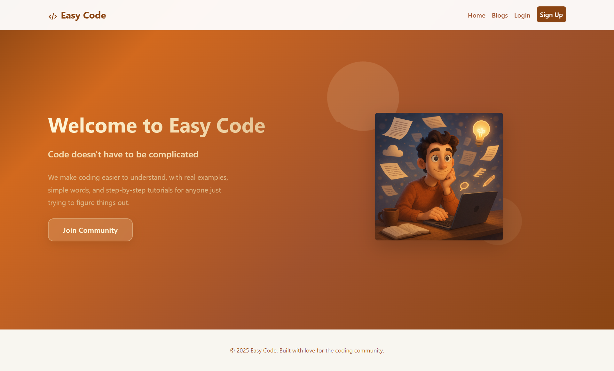
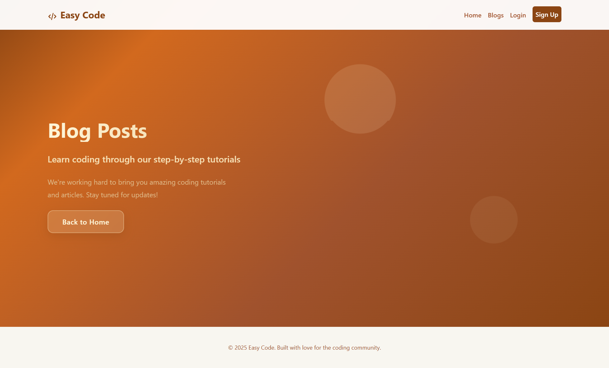

# Views - The Visual Part of Your Website

## What Are Views?

Views are the HTML pages that users see when they visit your website. Think of them as the "face" of your application - everything visual that users interact with.

In Laravel, views are stored in the `resources/views/` folder and have a `.blade.php` extension.

## Our Website Structure

We built a simple coding tutorial website with 4 main pages:


1. **Homepage** (`welcome.blade.php`) - The main landing page
2. **Blog** (`blog.blade.php`) - Where tutorials will be displayed
3. **Login** (`login.blade.php`) - User sign-in page
4. **Sign Up** (`signup.blade.php`) - New user registration

### Screenshots of Our Pages

<div style="display: grid; grid-template-columns: 1fr 1fr; gap: 20px; margin: 20px 0;">
  <div>
    <h4>Home Page</h4>
    
  </div>
  <div>
    <h4>Sign Up Page</h4>
    
  </div>
  <div>
    <h4>Login Page</h4>
    
  </div>
  <div>
    <h4>Blog Page</h4>
    
  </div>
</div>

## File Locations
resources/views/
├── layouts/
│   └── app.blade.php          # Master template (shared layout)
├── welcome.blade.php          # Homepage
├── blog.blade.php             # Blog page
├── login.blade.php            # Login page
└── signup.blade.php           # Sign up page

## How Views Work

Every view file in our project follows this basic pattern:

```php
@extends('layouts.app')

@section('title', 'Page Title Here')

@section('styles')
    <link rel="stylesheet" href="{{ asset('css/welcome.css') }}">
@endsection

@section('content')
    <!-- Your page content goes here -->
@endsection


1. Template Inheritance

```php
@extends('layouts.app')

This line tells Laravel: "Use the master layout from layouts/app.blade.php as the base for this page."
Why is this useful?

You don't repeat the same HTML (like navigation, header, footer) on every page
Change the layout once, and it updates everywhere
Keeps your code clean and organized

Where to find the master layout: resources/views/layouts/app.blade.php
We'll learn more about how this works in the Blade Templates section.